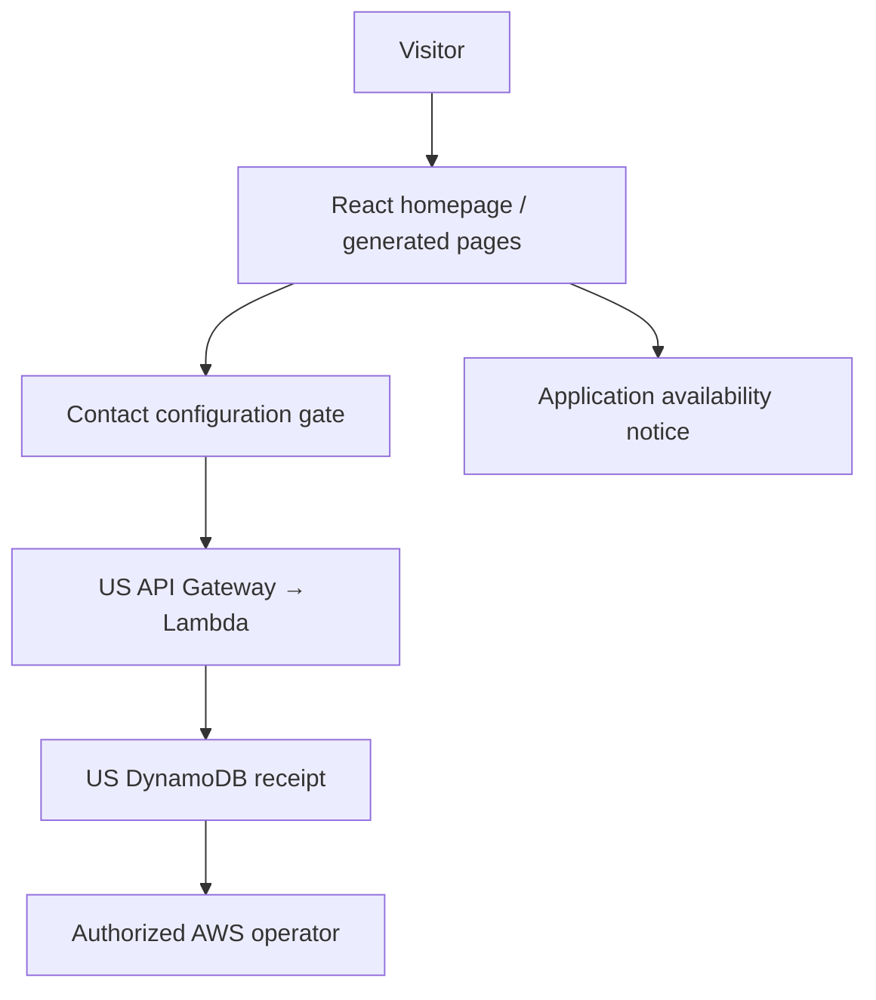
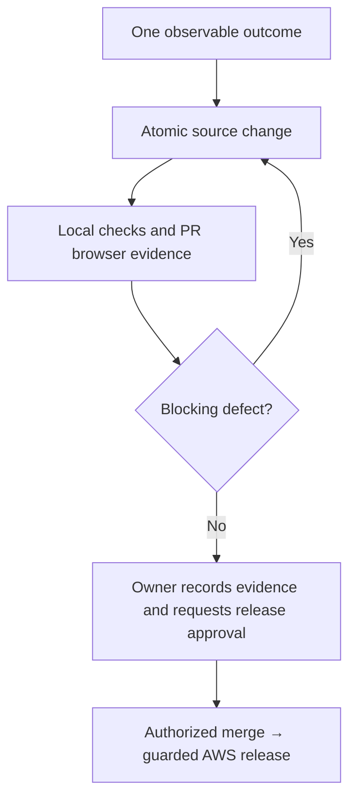

# Engineering and completion
## Start with one outcome
A visitor sees one director attribution and can reach contact@sozorock.com from Contact. This first change touched the React homepage and the deep-page generator; the generated contact page must be committed with its source. No backend or records change for that outcome.

## Necessary paths

D through F are designed in the enquiry template, not verified as deployed. There is no US application service or authenticated web admin. No enquiry email worker exists. Contact mail links open the visitor's email client and do not prove mailbox delivery.

## Work map
- `src/`: interactive homepage; `scripts/build-public-pages.mjs`: static page source.
- `scripts/prerender-home.mjs`: crawler-readable homepage.
- `infra/aws/school-platform.json`: deployable enquiry template; `infra/aws/enquiries.py`: handler reference. Check both when changing behavior; they currently duplicate handler code.
- `public/contact.js`: enquiry client; `public/engagement-config.js`: disabled default. Deployment preserves activated production configuration.
- `worker/` and `scripts/prepare-sites-build.mjs`: alternate Sites packaging. Keep its tests even though AWS is the production host.
- `scripts/deploy-aws-production.sh` and `.github/workflows/deploy-aws.yml`: production boundaries and rollback.
- [README](../README.md): existing bootstrap/activation instructions. Do not rerun bootstrap for routine content changes.

## Verification
`npm ci && npm run verify` runs the production build and existing packaging/content tests, also used by PR and deployment CI.

For changes affecting interaction, serve `dist/client` on port 4173, then run `python scripts/acceptance-public-site.py --base-url http://127.0.0.1:4173 --output-dir /tmp/school-review`. Install Python Playwright 1.58.0 and Chrome as in CI. The existing PR workflow performs this desktop/mobile review and saves evidence. No AWS access is needed for PR review.

Completion means the specified visitor outcome works on the built revision; relevant checks pass; any backend claim has a verified write and authorized readback; and blockers are explicit. A rejected honeypot request only proves rejection, not successful service operation.

## Review and release

Do not push main before release approval. Preserve existing tests; add checks for demonstrated risks rather than duplicating implementation. Load browser guidance for interactions and Blender guidance for motion; don't load unrelated skills. No new agent orchestration framework is needed.

## Current operations blockers — 2026-09-06
- No AWS operator access or authenticated Google Workspace session was available during this review. No admin username/password was recovered or created. Passwords must not enter source, logs or review descriptions; issue a secure invitation/reset after confirming the operator identity.
- US application/admin backend is absent. Reuse AWS API Gateway, Lambda, DynamoDB and Cognito independently in the US account; require application validation, idempotent durable receipt, authorized operator readback, retention and recovery before removing closed-intake copy.
- Public DNS observed: MX points to Amazon SES inbound in us-east-1; SPF authorizes amazonses.com; DMARC is `p=none`. Google DKIM's common selector was not present; the actual selector and SES receipt rules remain unknown.
- Do not replace MX blindly: inspect SES forwarding/storage rules and Workspace domain/licence status first. Confirm whether the requested addresses are existing users, aliases or shared mailboxes before purchasing licences.
- Authenticate every legitimate sender with one complete SPF record and provider-generated DKIM; inspect reports before tightening DMARC. The current monitoring policy does not reject spoofing. Mail delivery and header alignment remain unverified. [Google SPF guidance](https://support.google.com/a/answer/12082590) and [DMARC setup](https://support.google.com/a/answer/2466580).
