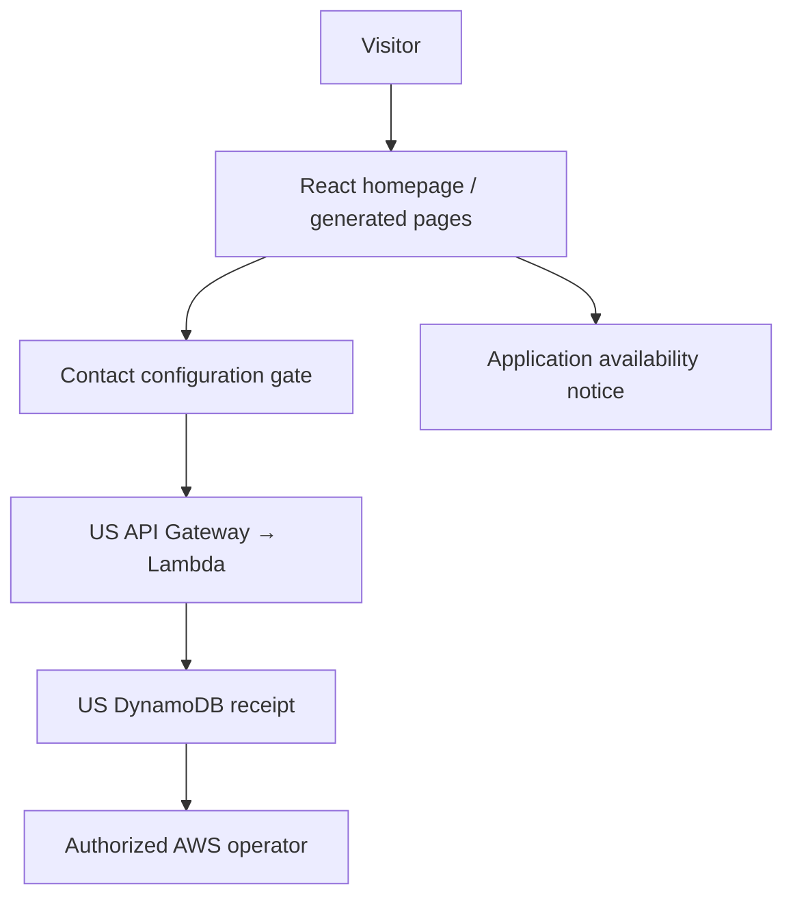
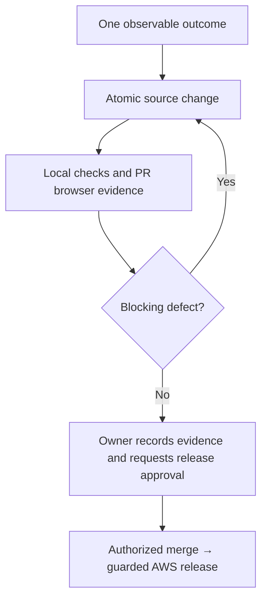

# Engineering and completion
## Start with one outcome
A visitor sees one director attribution and can reach contact@sozorock.com from Contact. This first change touched the React homepage and the deep-page generator; the generated contact page must be committed with its source. No backend or records change for that outcome.

## Necessary paths

```mermaid
flowchart TD
  A["Visitor"] --> B["React homepage / generated pages"]
  B --> C["Contact configuration gate"]
  C --> D["US API Gateway → Lambda"]
  D --> E["US DynamoDB receipt"]
  E --> F["Authorized AWS operator"]
  B --> G["Application availability notice"]
```
On September 8, 2026, the US enquiry service was deployed with verified durable writes, retries and authorized DynamoDB readback. School application intake was later enabled and a September 14 release recorded an authenticated staff readback with MFA. The September 22 website release is blocked by an expired operational acceptance record; see [the current release runbook](corporate-release.md). No enquiry email worker exists. Mail links do not prove mailbox delivery.

## Work map
- `src/`: interactive homepage; `scripts/build-public-pages.mjs`: static page source.
- `scripts/prerender-home.mjs`: crawler-readable homepage.
- `infra/aws/school-platform.json`: template skeleton; `infra/aws/enquiries.py`: authoritative handler. Generate the deployable template with `scripts/build-enquiries-template.py`.
- `public/contact.js`: enquiry client; `public/engagement-config.js`: disabled default. Deployment preserves activated production configuration.
- `worker/` and `scripts/prepare-sites-build.mjs`: alternate Sites packaging. Keep its tests even though AWS is the production host.
- `scripts/deploy-aws-production.sh` and `.github/workflows/deploy-aws.yml`: production boundaries and rollback.
- [README](../README.md): existing bootstrap/activation instructions. Do not rerun bootstrap for routine content changes.

## Verification
`npm ci && npm run verify` runs the production build and existing packaging/content tests, also used by PR and deployment CI.

For changes affecting interaction, use `node scripts/preview-server.mjs` on port 4173, then run `python scripts/acceptance-public-site.py --base-url http://127.0.0.1:4173 --output-dir /tmp/school-review`. Install Python Playwright 1.58.0 and Chrome as in CI. The existing PR workflow performs this desktop/mobile review and saves evidence. No AWS access is needed for PR review.

Completion means the specified visitor outcome works on the built revision; relevant checks pass; any backend claim has a verified write and authorized readback; and blockers are explicit. A rejected honeypot request only proves rejection, not successful service operation.

## Review and release

```mermaid
flowchart TD
  A["One observable outcome"] --> B["Atomic source change"]
  B --> C["Local checks and PR browser evidence"]
  C --> D{"Blocking defect?"}
  D -->|Yes| B
  D -->|No| E["Owner records evidence and requests release approval"]
  E --> F["Authorized merge → guarded AWS release"]
```
Do not push main before release approval. Preserve existing tests; add checks for demonstrated risks rather than duplicating implementation. Load browser guidance for interactions and Blender guidance for motion; don't load unrelated skills. No new agent orchestration framework is needed.

## September 6 review notes and current release boundary
- No AWS operator access or authenticated Google Workspace session was available during the September 6 review. No admin username/password was recovered or created. Passwords must not enter source, logs or review descriptions; do not reset an existing working account merely to test recovery. Use the existing account for staff verification; any genuinely necessary recovery must follow verified operator identity and the established recovery process.
- US application/admin resources were subsequently activated and verified on September 14. New site releases still require fresh operational evidence; the September 22 attempt failed because that record expired. Preserve the enabled application configuration and current MFA boundary.
- Public DNS observed: MX points to Amazon SES inbound in us-east-1; SPF authorizes amazonses.com; DMARC is `p=none`. Google DKIM's common selector was not present; the actual selector and SES receipt rules remain unknown.
- Do not replace MX blindly: inspect SES forwarding/storage rules and Workspace domain/licence status first. Confirm whether the requested addresses are existing users, aliases or shared mailboxes before purchasing licences.
- Authenticate every legitimate sender with one complete SPF record and provider-generated DKIM; inspect reports before tightening DMARC. The current monitoring policy does not reject spoofing. Mail delivery and header alignment remain unverified. [Google SPF guidance](https://support.google.com/a/answer/12082590) and [DMARC setup](https://support.google.com/a/answer/2466580).

## US application preparation

The separate [application service runbook](us-applications.md) documents the initial disabled-state provisioning and acceptance steps. Intake was subsequently activated; renewal for website releases follows [the current release runbook](corporate-release.md). The admin shell is `public/admin.html`; its data requires Cognito access tokens and the Admins group.

## Current security and product review

See [5 October release evidence and operator boundaries](security-release-2026-10-05.md). Earlier mail-DNS and intake notes are historical; the new review distinguishes current observations from authenticated or permission-limited checks.
