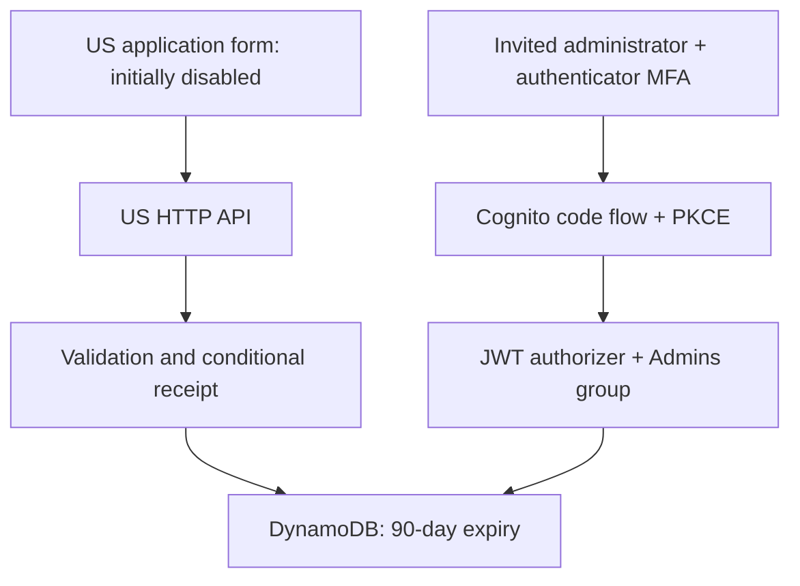

# US application service: preparation and activation

This service belongs only to account **791860731989**, **us-east-1**. It does not reuse Canada, replace enquiries, send email, process payments, provision DNS, or change the public application gate. One reviewed source, `infra/aws/applications.py`, is embedded at build time by `scripts/build-applications-template.py`; do not maintain a second inline handler.



## Provision without opening intake

From a reviewed repository checkout in AWS CloudShell in the US hosting account:

```bash
bash scripts/provision-us-applications.sh
```

The script verifies the account, uses us-east-1 explicitly, validates and deploys a separate CloudFormation stack with `IntakeEnabled=false`, and prints non-secret configuration outputs. It provisions billable AWS resources. Rerunning it deliberately closes the service; it is not a routine website deployment command. The existing website release role is not assumed to have provisioning permissions.

The Cognito pool prohibits public sign-up, requires authenticator-app MFA, uses short-lived access tokens, and supports authorization code + PKCE with callback `https://www.sozorock.com/admin.html`. Create an administrator in Cognito's Users console using their confirmed email, securely issue the invitation, and add that user to the exact `Admins` group. Complete the temporary-password change and MFA setup. Do not store passwords or tokens in source, shell history, review evidence or browser localStorage. No admin user/password exists until an operator creates it. Google Workspace is independent of this authentication pool.

## Contract

`POST /applications` accepts JSON: `requestId` (lowercase UUID), `name` (2–100 characters), `email` (up to 254), `programme`, `motivation` (20–3000), `consent: true`, optional empty `website` honeypot. Programme values are `applied-ai-systems`, `cybersecurity-grc`, `identity-access-management`, `ai-governance`.

A durable conditional write returns HTTP 200 `{id, status: "received"}`. Same reference and same normalized details returns the same receipt after a consistent read. Conflicting reuse returns 409. Validation returns 400; storage uncertainty or disabled service returns 503. The client must preserve its request ID for retries and must never render a receipt on failure. Consent version `us-applications-v1` must correspond to the published collection disclosure before activation.

`GET /admin/applications?limit=25&cursor=...` requires an access token in the Authorization Bearer header, API Gateway JWT verification, correct client ID, and `Admins`. It returns `{items, nextCursor}`. Follow `nextCursor` even when `items` is empty: expiry filtering can produce an empty intermediate page. Items omit the internal request digest. Limit 1–100 bounds each call. This is a scan for a small initial intake; it has no sorted order or snapshot consistency between pages, and concurrent additions can require a fresh refresh. Add indexed access when measured volumes justify it.

## Required live acceptance before activation

1. Keep the public application configuration disabled. Confirm anonymous admin requests are denied and invited administrator login requires MFA.
2. Change the stack parameter `IntakeEnabled` to `true` during the acceptance window. Keep all other parameters/resources unchanged. If acceptance fails, restore it to `false`.
3. Submit a synthetic application using an operator-controlled address and a fresh UUID. No notification worker exists, so this writes a record but sends no email. Confirm HTTP 200 and save only its receipt reference, not personal data, in evidence.
4. Replay the exact request. Confirm the same receipt and exactly one stored item. Replay with altered details and confirm 409.
5. With the administrator access token, read the application through `/admin/applications`, following every cursor until found. Confirm a non-Admins token cannot read the same API. Test a second page and validate error/retry behavior without exposing tokens.
6. Confirm public privacy/consent text describes this application collection and 90-day retention. Confirm admin browser renders applicant text as text, not HTML.
7. Only after these checks pass may the integration owner publish the separate US application configuration and remove unavailable copy. Exercise the live visitor submission and administrator readback again after publication.

No live acceptance or AWS provisioning has been performed by the unit tests. The code is preparation, not evidence that applications are open.

## Retention, recovery and operating limits

DynamoDB TTL expires application data after 90 days; physical deletion is asynchronous. Admin retrieval filters expired items immediately. Point-in-time recovery protects against accidental changes; backups can retain deleted values within the recovery window. Both table and Cognito pool are retained on stack deletion to avoid accidental destruction. Operators must account for retained resources and backups when fulfilling deletion requests or retiring the service; TTL is not immediate erasure. The handler does not log bodies or applicant data. Lambda logs expire after 14 days.

API throttling and Lambda concurrency bound load; CORS/honeypots are not bot authentication. Monitor initial intake before enabling broadly; persistent abuse requires a demonstrated additional control. No email notification, application decision workflow, payment collection, or self-service deletion endpoint is claimed. Admin recovery is operator-assisted. Preserve a separate authorized recovery operator before onboarding the sole administrator.

## Verification

```bash
python3 -m unittest discover -s tests -p 'test_applications.py' -v
bash -n scripts/provision-us-applications.sh
python3 scripts/build-applications-template.py > /tmp/us-applications.json
```

Unit tests exercise input rejection, write failure, idempotent replay/conflict, unavailable intake, admin client/group/token boundaries, empty-page continuation, storage failures and handler/template consistency. They use a simulated DynamoDB client. CloudFormation schema validation, actual Cognito challenges, IAM permissions, API Gateway signature enforcement, persistence and browser integration require the live acceptance above.

References: [AWS HTTP API JWT verification](https://docs.aws.amazon.com/apigateway/latest/developerguide/http-api-jwt-authorizer.html), [Cognito administrator-created users](https://docs.aws.amazon.com/cognito/latest/developerguide/how-to-create-user-accounts.html).
